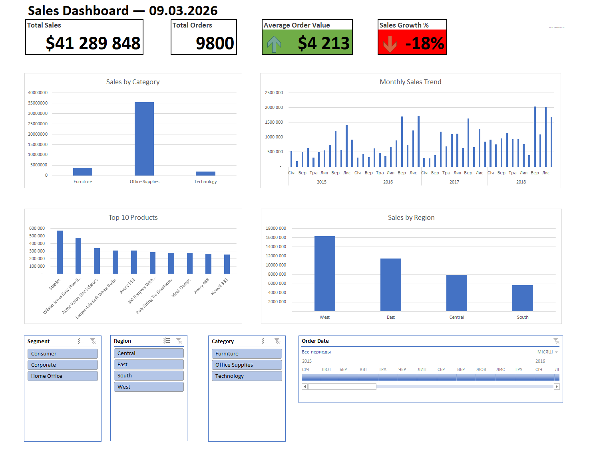

# Excel Sales Dashboard

This project is an interactive sales performance dashboard built in Microsoft Excel using the Superstore dataset.

The goal of the project is to analyze sales performance across regions, product categories, and time periods using business KPIs and interactive filters.

## Dashboard Preview

## Key Features

* KPI metrics:

  * Total Sales
  * Total Orders
  * Average Order Value
  * Sales Growth %

* Pivot Tables and Pivot Charts

* Interactive slicers (Segment, Region, Category)

* Timeline filter for time analysis

* Top products analysis

* Regional sales comparison

* Category performance analysis

## Tools & Skills Used

* Microsoft Excel
* Pivot Tables
* Pivot Charts
* Data Analysis
* Conditional Formatting
* Dashboard Design
* Business KPI Metrics

## Key Insights

* Technology category generates the highest revenue.
* West region has the strongest sales performance.
* Office Supplies contains the largest variety of products.
* Sales trends show strong growth in later years.

## Dataset

The analysis uses the **Superstore dataset**, which is widely used for sales analytics and business intelligence practice.
